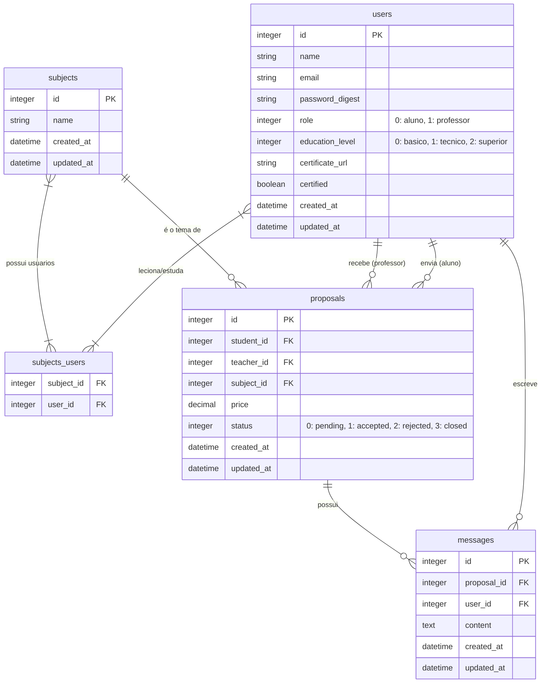

# aprendeAI

Bem-vindo ao repositório oficial do **aprendeAI**, o MVP submetido para avaliação no Hackathon SIF/UniRios 2026.

## 📌 O Problema
O acesso a professores particulares de qualidade, especialmente para ensino técnico ou de base, sofre com ruídos de comunicação, falta de transparência em valores e dificuldade de validação profissional.

## 💡 A Solução (aprendeAI)
O **aprendeAI** é uma plataforma focada na conexão direta entre alunos e professores.
O sistema provê uma interface limpa onde **alunos** buscam professores capacitados por área de ensino e enviam **propostas** de aula com valores sugeridos. **Professores** com certificação validada recebem essas propostas e podem aceitá-las, recusá-las ou negociar detalhes através do chat integrado à proposta. A plataforma garante regras de piso salarial justo para profissionais de nível técnico ou superior.

## 🛠 Tecnologias Utilizadas
- **Ruby on Rails** (Backend / Framework Principal - v8.x)
- **SQLite** (Banco de Dados Leve e Nativo)
- **Tailwind CSS** (Estilização UI/UX - Monocromático Verde)
- **Minitest** (Testes Automatizados Nativos)

## 🏗 Abordagem e Metodologia
- **Pragmatismo e Simplicidade:** Arquitetura monolítica tradicional MVC, evitando abstrações complexas (sem APIs desnecessárias ou SPAs).
- **Sem Dados Falsos (No Mocks):** A apresentação pode ser feita do zero. O banco de dados nasce apenas com o *catálogo estrutural* (matérias), cabendo ao usuário realizar o fluxo real.
- **Isolamento por Papéis (RBAC Simples):** O sistema isola as visões através de `enums` simples no banco, garantindo que alunos só naveguem por perfis de professores e vice-versa.
- **Estado Controlado:** O fluxo de propostas obedece a uma máquina de estado rigorosa (`Pendente` -> `Aceita` ou `Recusada` -> `Fechada`).

---

## 🚀 Como Executar o Projeto

Certifique-se de ter o Ruby instalado (compatível com a versão do Rails).

**1. Clone o repositório e instale as dependências:**
```bash
bundle install
```

**2. Configure o banco de dados (SQLite):**
```bash
rails db:migrate
```

**3. Carregue o Catálogo Estrutural:**
*Importante: Este comando carrega apenas as Áreas de Ensino (Matemática, Programação, etc.). Ele **não** carrega usuários fake, respeitando a regra de demonstração real.*
```bash
rails db:seed
```

**4. Execute a suíte de testes (Opcional, para validação):**
```bash
rails test
```

**5. Inicie o servidor local:**
```bash
bin/dev
# ou alternativamente: rails server
```
Acesse `http://localhost:3000` em seu navegador.

---

## 🗄️ Modelo Lógico do Banco de Dados (ERD)

Abaixo o diagrama entidade-relacionamento do nosso banco de dados relacional.



*Fim da Documentação.*
