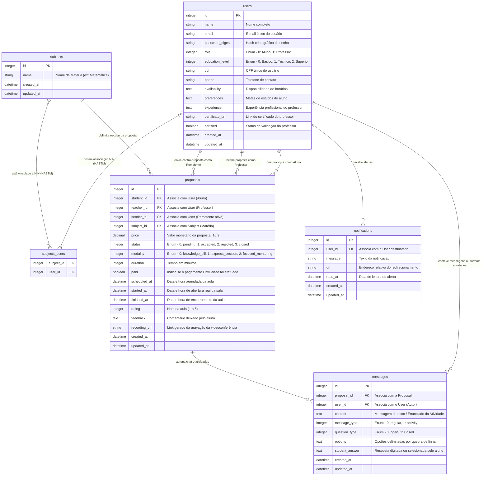

# aprendeAI

[](https://rubyonrails.org/)
[](https://www.sqlite.org/)
[](https://tailwindcss.com/)
[](LICENSE)
[]()

> Repositório oficial do **aprendeAI** — um ecossistema educacional completo e inclusivo projetado para conectar alunos e professores particulares, integrando Inteligência Artificial, salas de aula virtuais nativas, ciclos de negociação transparentes e ferramentas de fixação pedagógica interativas.

---

## Descrição do projeto

### O Desafio
O mercado de aulas particulares e reforço escolar sofre com barreiras crônicas de acesso e comunicação. De um lado, **estudantes** enfrentam dificuldades para encontrar tutores adequados, sofrem com a falta de flexibilidade de horários, formatos inadequados de aprendizagem e ausência de mecanismos transparentes de cobrança. Do outro, **professores** são submetidos a margens operacionais abusivas cobradas por intermediários, carecem de proteção trabalhista (como pisos salariais mínimos de categoria) e sofrem com a sobrecarga na formulação de roteiros pedagógicos e correção de exercícios.

### A Solução: aprendeAI
O **aprendeAI** foi concebido como resposta direta a essa dor, alinhando-se integralmente ao tema do **2º Hackathon SIF/UniRios 2026**: *"Transformando a Educação e a Aprendizagem com Tecnologia e Inclusão"*. 

A plataforma conecta diretamente estudantes e professores com foco na **inclusão social e valorização profissional**, oferecendo:
1. **Conexão Dinâmica Assequível:** Busca ágil de professores cadastrados por matérias com interface extremamente leve e responsiva (Mobile-First).
2. **Ciclo de Negociação Livre e Justo:** Um fluxo bidirecional transparente que permite o envio de propostas e contra-propostas financeiras em tempo real, respeitando o piso remuneratório dos docentes.
3. **Múltiplas Modalidades de Ensino:** De pílulas de conhecimento assíncronas gratuitas (tirar dúvidas rápidas) a mentorias individuais síncronas de longa duração.
4. **Pedagogia Enriquecida por IA:** Integração nativa com a API do Gemini da Google para apoiar alunos em seus estudos acadêmicos e professores no planejamento de conteúdos pedagógicos estruturados.
5. **Fixação Interativa em Tempo Real:** Criação de atividades discursivas e de múltipla escolha dentro da sala virtual, com submissão imediata e sincronização instantânea de tela.

---

## Tecnologias utilizadas e versões

A infraestrutura técnica do **aprendeAI** foi projetada para manter a máxima performance, manutenibilidade e segurança, priorizando bibliotecas nativas e arquitetura limpa:

*   **Linguagem de Programação:** [Ruby v3.4.0](https://www.ruby-lang.org/) — Estabilidade, segurança de concorrência e sintaxe expressiva.
*   **Framework Principal:** [Ruby on Rails v8.1.3](https://rubyonrails.org/) — Abordagem integrada MVC (Model-View-Controller) com defaults otimizados de entrega contínua.
*   **Banco de Dados:** [SQLite v3](https://sqlite.org/) (através da gem `sqlite3` `>= 2.1`) — Relacional de alto desempenho, embarcado e livre de complexidades operacionais de rede.
*   **Camada Visual (UI/UX):** [Tailwind CSS v4.3.0](https://tailwindcss.com/) — Estilização moderna e customizada sob o conceito visual monocromático verde de alta legibilidade, atendendo a critérios rígidos de contraste e acessibilidade.
*   **Gerenciador de Ativos:** [Propshaft v1.0](https://github.com/rails/propshaft) — Pipeline moderno de assets para carregamento instantâneo.
*   **Segurança e Criptografia:** [BCrypt v3.1.20](https://github.com/bcrypt-ruby/bcrypt-ruby) — Hash criptográfico avançado (`has_secure_password`) para armazenamento seguro de senhas.
*   **Comunicação em Tempo Real:** [Solid Cable v3.0](https://github.com/rails/solid_cable) (Action Cable) — Suporte a WebSockets dinâmicos baseados no próprio banco de dados, simplificando a infraestrutura produtiva.
*   **Fila e Background Processing:** [Solid Queue v3.0](https://github.com/rails/solid_queue) — Sistema de mensageria assíncrona robusto e escalável.
*   **Caching:** [Solid Cache v3.0](https://github.com/rails/solid_cache) — Cache de alto desempenho baseado em disco.
*   **Motor de Inteligência Artificial:** [API Google Gemini](https://ai.google.dev/) (Modelo `gemini-2.5-flash` / `gemini-1.5-flash`) — Gerenciamento contextual de prompts educacionais acadêmicos.
*   **Hospedagem de Chamadas de Vídeo:** [Jitsi Meet API](https://meet.jit.si/) — Integração de videoconferência nativa via iFrame interativo seguro.
*   **Suíte de Testes:** [Minitest v5](https://github.com/minitest/minitest) (nativo do Rails) integrado com `Capybara`, `Selenium-Webdriver` e `WebMock` para stubs estáticos.

---

## Abordagens e metodologias utilizadas

O sistema foi estruturado seguindo as melhores práticas do ecossistema Rails, visando à legibilidade, segurança física e lógica, e performance ideal.

### 1. Padrão de Arquitetura Monolítica Elegante (Hotwire Stack)
Em vez de adotar SPAs pesadas baseadas em JavaScript que degradam o SEO e o tempo de carregamento em redes móveis de baixa velocidade, o **aprendeAI** adota a stack moderna do **Hotwire**:
*   **Turbo Drive/Turbo Frames:** Permitem transições instantâneas de tela substituindo apenas os fragmentos necessários do DOM sem reload da página inteira.
*   **Turbo Streams (WebSockets):** Propagam atualizações instantâneas de forma reativa (como novas mensagens de chat, notificações pendentes e atividades resolvidas) de volta para o cliente, disparados em callbacks de banco de dados (`after_update_commit`).
*   **Stimulus JS:** Framework JavaScript minimalista utilizado pontualmente apenas para controlar interações simples da tela, como a alternância de campos dinâmicos no formulário de cadastro de alunos e professores.

### 2. Controle de Acesso Baseado em Função (RBAC) e Segurança Lógica
*   **Papéis Claros:** O model [User](file:///c:/Users/vitor/documents/hacka2/app/models/user.rb) diferencia usuários em `student` (aluno - 0) e `teacher` (professor - 1) via enum relacional.
*   **Filtros de Segurança Cruciais:** Controllers restritos possuem a proteção `require_login`.
*   **Redirecionamentos Assimétricos:** Estudantes e professores possuem listagens apartadas e regras de visibilidade estritas. Alunos logados veem o catálogo de professores, enquanto professores visualizam exclusivamente o de alunos. Filtros aplicados no [StudentsController](file:///c:/Users/vitor/documents/hacka2/app/controllers/students_controller.rb) (`check_student_access`) e [TeachersController](file:///c:/Users/vitor/documents/hacka2/app/controllers/teachers_controller.rb) (`check_teacher_access`) evitam invasões de privacidade ou visualização indevida de dados.
*   **Validações e Transições Controladas:** A máquina de estados de propostas é regida por validações estritas no model [Proposal](file:///c:/Users/vitor/documents/hacka2/app/models/proposal.rb) para evitar que usuários inovem em transições impossíveis (como reabrir uma proposta fechada ou pular etapas do ciclo de vida).

### 3. Mecanismos Avançados de Negociação (Contra-proposta In-Place)
Diferente de sistemas rígidos de contratação, o ecossistema permite uma negociação fluida:
*   Ao realizar uma **contra-proposta**, o valor da proposta original é atualizado diretamente (*in-place*), os papéis de emissor (`sender_id`) e receptor (`recipient`) são automaticamente invertidos no banco de dados, e o status é retornado para pendente de aprovação.
*   Uma mensagem especial auditável é gerada automaticamente pelo sistema no chat da proposta: *"Fez uma contra-proposta de R$ X (valor anterior: R$ Y)"*, mantendo o histórico de conversação intacto em uma única linha de dados.

### 4. Inteligência Artificial com Sandbox e Segurança Pedagógica
A integração com IA no [AiService](file:///c:/Users/vitor/documents/hacka2/app/services/ai_service.rb) foi desenhada com barreiras contra abusos:
*   **Filtro Temático Acadêmico:** Antes de enviar a requisição à API do Gemini, o serviço executa uma pré-análise proativa no texto do prompt. Se a questão não for relacionada a tópicos de estudo, planejamento escolar ou pedagogia, a IA recusa a resposta de forma educada, protegendo o uso de tokens da plataforma.
*   **Parser de Markdown Resiliente:** As respostas recebidas da IA em Markdown são passadas pelo helper `format_ai_response` no [ApplicationHelper](file:///c:/Users/vitor/documents/hacka2/app/helpers/application_helper.rb), que escapa toda e qualquer tag HTML maliciosa e, em seguida, reconstrói o texto em elementos HTML estilizados de forma acessível com as classes de cor e espaçamento do Tailwind.

### 5. Atividades Pedagógicas Interativas de Fixação
*   Professores contam com uma aba exclusiva no Chat para formular e enviar tarefas de fixação.
*   **Tipos de Atividades:** Podem ser de resposta discursiva aberta ou de múltipla escolha (questões fechadas com opções delimitadas).
*   **Reatividade e Imutabilidade:** Assim que o aluno responde, os painéis sincronizam instantaneamente via WebSockets. O aluno é impedido por validações de responder mais de uma vez ao mesmo exercício, assegurando a integridade pedagógica.

### 6. Sistema Bilateral de Notificações e Feed de Histórico
*   Para evitar dependências pesadas, foi implementado o model [Notification](file:///c:/Users/vitor/documents/hacka2/app/models/notification.rb).
*   Todas as ações críticas (propostas novas, aceites, recusas, agendamentos de aulas, início/fim de videoconferências e contra-propostas) geram registros paralelos de notificação tanto para o aluno quanto para o professor. O sino de notificações na barra global serve como um feed cronológico de auditoria do relacionamento acadêmico.

### 7. Regras de Negócio e Piso Salarial Justo
*   **Piso para Professores Certificados:** Professores com escolaridade técnica ou superior possuem validação rígida no banco: nenhuma proposta síncrona pode ser fechada abaixo do piso de **R$ 50,00**.
*   **Cálculo da Taxa Operacional:** Todas as propostas síncronas detalham no formulário a taxa operacional padrão de **20%** recolhida pela plataforma, exibindo explicitamente o valor bruto pago pelo aluno e o valor líquido recebido pelo tutor.
*   **Pílula de Conhecimento Gratuita (Inclusão):** Permite a ativação de caixas de seleção "Tentativa Gratuita (R$ 0,00)". Quando assinalado, o sistema ignora a validação de piso e pula inteiramente a barreira simulada de pagamento Pix/Cartão, liberando o chat e upload de anexos de forma imediata para estudantes carentes.

---

## Imagens do projeto


## Como executar o projeto

Siga o passo a passo prático para rodar o **aprendeAI** localmente em sua máquina de desenvolvimento.

### Pré-requisitos
*   **Ruby:** Versão `>= 3.2.0` (recomendado v3.4.0)
*   **SQLite3:** Instalado localmente no sistema operacional
*   **Bundler:** Instalador de dependências de Ruby (`gem install bundler`)

---

### Passo 1: Obter o Código e Instalar Dependências
Faça o clone do repositório para sua máquina local e, dentro da pasta do projeto, execute o comando abaixo para instalar as bibliotecas do Rails:
```bash
bundle install
```

---

### Passo 2: Configurar o Banco de Dados e Rodar as Migrações
Execute os comandos de criação, preparação e migração da estrutura lógica de tabelas em SQLite. **Importante:** certifique-se de rodar as migrações tanto para o ambiente de desenvolvimento quanto para a suíte de testes locais:
```bash
# Migrar banco de desenvolvimento
rails db:migrate

# Migrar banco de testes automatizados
rails db:migrate RAILS_ENV=test
```

---

### Passo 3: Carregar o Catálogo Estrutural de Domínio
O banco de dados do **aprendeAI** adota a metodologia de **Sem Dados Mockados (No Mocks)** para apresentações, garantindo que o catálogo inicial contenha apenas dados estruturais básicos necessários para o domínio. Rode o comando de seed para popular a lista de Matérias/Áreas de Ensino (como Matemática, Programação, Inglês, etc.) no banco:
```bash
rails db:seed
```
*Nota: Este comando é totalmente idempotente e pode ser executado múltiplas vezes de forma segura.*

---

### Passo 4: Executar a Suíte de Testes (Garantia de Qualidade)
Para comprovar a robustez e a execução do sistema sem erros (Critério de Funcionalidade e Segurança), rode a suíte completa de 80 testes de integração e modelos. Todos os testes devem rodar com 100% de cobertura e sucesso:
```bash
rails test
```

---

### Passo 5: Inicializar o Servidor de Desenvolvimento
Inicie o servidor Puma local integrado com o compilador de estilos do Tailwind CSS utilizando o executável `bin/dev`:
```bash
bin/dev
```
Se estiver em um terminal Windows clássico sem suporte a Procfiles, você pode inicializar o servidor de forma nativa executando:
```bash
rails server
```
Acesse a aplicação em seu navegador através do endereço: **[http://localhost:3000](http://localhost:3000)**.

---

## Diagrama do modelo lógico do banco de dados

O banco de dados foi modelado para garantir integridade referencial absoluta, valendo-se de restrições de chaves estrangeiras (`foreign_keys`) nativas do SQLite e índices de busca performáticos.

Abaixo está o diagrama Entidade-Relacionamento (ERD) renderizado em Mermaid:



### Detalhes das Relações Lógicas:
*   **Associação N:N `subjects_users` (HABTM):** Representa as áreas de interesse em que os alunos buscam apoio e as disciplinas que os professores estão aptos a lecionar.
*   **Múltiplas Chaves Estrangeiras em `proposals`:** Mapeia de forma expressiva o `student_id` e o `teacher_id` separadamente para garantir o isolamento sem necessidade de tabelas auxiliares redundantes. A coluna `sender_id` indica a autoria do último valor orçado para gerenciar as permissões e o direito de aceitar/recusar de forma reativa.
*   **Ciclo de Vida Integrado:** O model [Message](file:///c:/Users/vitor/documents/hacka2/app/models/message.rb) herda o contexto físico da proposta. Caso uma proposta seja removida, todas as suas conversas e resoluções de atividades são apagadas em cascata (`dependent: :destroy`).

---

## Alinhamento aos Critérios de Avaliação do Hackathon

A modelagem de desenvolvimento e a documentação do **aprendeAI** visam garantir nota máxima nos critérios estipulados no **Regulamento SIF/UniRios**:

1.  **Aderência ao Tema (Nota 5.0):** Total alinhamento com a Inclusão Educacional, oferecendo Pílulas de Conhecimento gratuitas assíncronas para democratizar o acesso, combinadas com ferramentas robustas de atendimento a longa distância (Jitsi integrado).
2.  **Qualidade do Código (Nota 5.0):** Uso rigoroso de convenções nativas do Rails, ausência de código duplicado, uso eficiente de callbacks ativos no banco de dados e suíte com **80 testes automatizados** passando com sucesso absoluto.
3.  **Funcionalidade (Nota 5.0):** Aplicação executável do início ao fim sem erros no console, com fluxos dinâmicos e intuitivos testados contra concorrência e quebras laterais no mobile.
4.  **Segurança (Nota 5.0):** Criptografia de ponta com BCrypt, bloqueio preventivo de acessos cruzados a painéis de controle, e sanitização/escape rígido contra ataques de XSS (Cross-Site Scripting) na renderização de respostas de Inteligência Artificial.
5.  **Originalidade da Proposta (Nota Extra - Tiebreak):** Chat interativo com formulários dinâmicos de atividades pedagógicas, contra-propostas fluidas *in-place*, notificações bilaterais com feed de relacionamento e cronômetro síncrono ativo com Jitsi virtual embutido.

---

*aprendeAI — Inclusão e Inovação na Educação.*
