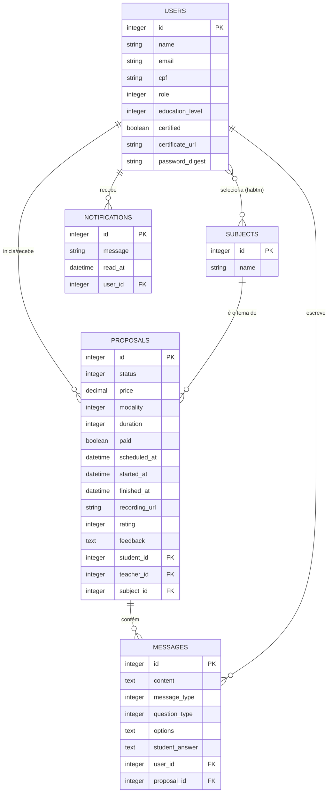

# AprendeAI - Plataforma Educacional Inclusiva

Bem-vindo ao **AprendeAI**, um projeto desenvolvido para o **Hackathon SIF/UniRios 2026** focado em "Transformando a Educação e a Aprendizagem com Tecnologia e Inclusão".

---

## 🎯 Descrição do Projeto

### O Problema
No atual cenário educacional, existe uma barreira de conexão estruturada entre alunos buscando conhecimentos específicos e professores/tutores qualificados. Além disso, frequentemente falta aos profissionais da educação a garantia de uma valorização justa pelo seu trabalho e qualificação.

### Para quem foi feito
O **AprendeAI** atende a dois perfis principais:
- **Alunos:** Indivíduos buscando tutoria, mentorias focadas ou tira-dúvidas rápidos ("Pílulas de Conhecimento").
- **Professores e Tutores:** Profissionais da educação que desejam rentabilizar seu tempo com segurança, garantia de piso salarial para certificados, e um ambiente unificado de aulas e pagamentos.

### O Valor da Solução
A plataforma digitaliza todo o ciclo da educação particular:
1. **Busca e Match:** Conecta alunos a professores certificados em disciplinas específicas.
2. **Negociação Justa:** Fluxo de contra-propostas e orçamentos (Bounty) com piso garantido para professores certificados técnica ou superiormente.
3. **Execução Síncrona/Assíncrona:** Chat ao vivo, resolução de atividades pedagógicas, cronômetro de aulas e Jitsi Meet nativo para videochamadas.
4. **Governança:** Gravação de aulas para auditoria, ranqueamento por feedback de alunos, histórico estruturado e feed de notificações.

---

## 💻 Tecnologias Utilizadas e Versões

O projeto foi construído atendendo estritamente ao regulamento do hackathon, utilizando um **framework de desenvolvimento** padrão da indústria e um **banco de dados** relacional.

- **Framework Web:** Ruby on Rails (v8.1.0)
- **Linguagem:** Ruby (v3.4.1)
- **Banco de Dados:** SQLite3 (nativo, configurado para ambiente local e testes)
- **Front-end / UI:** Tailwind CSS (v4.0, via Tailwind CSS for Rails) + Hotwire (Turbo/Stimulus) para reatividade sem SPAs complexas.
- **Integração de Vídeo:** Jitsi Meet API (iFrame dinâmico).
- **Apoio e Inteligência:** Integração com Antigravity/Gemini AI para estruturação de currículo ("Aprender com IA" / "Ensinar com IA").

---

## 🧠 Abordagens e Metodologias Utilizadas

A arquitetura do sistema foi guiada pelo **pragmatismo** e alinhada às exigências de aderência, funcionalidade e qualidade de código do regulamento:

1. **Design de Banco de Dados Otimizado (Single Table Role):** Em vez de criar tabelas separadas para Alunos e Professores, utilizamos a tabela `users` com a flag `role` (Enum), centralizando a autenticação e permitindo flexibilidade na plataforma.
2. **Sistema de Status por Máquina de Estado (State Machine):** O fluxo de negociação (a entidade central `Proposal`) transita rigidamente entre os status: `pending` → `accepted` → `paid` → `closed`, garantindo a integridade financeira e de segurança da aplicação.
3. **Lógica de Negócio Enxuta no Model ("Fat Models, Skinny Controllers"):** As validações de negócio, como o **Piso Salarial (mínimo de R$ 50 para certificados)** e a impossibilidade de autoproposta, foram colocadas diretamente nos *Models* do Rails, protegendo o banco.
4. **Comunicação Reativa (Bilateralidade):** Emprego de WebSockets (ActionCable via Turbo Streams) para garantir que mensagens do chat, contra-propostas e o recebimento de notificações ocorram em tempo real na tela do usuário.
5. **Autenticação Segura Nativa:** Uso de sessões e cookies cifrados pelo Rails (`has_secure_password` com BCrypt), sem depender de bibliotecas pesadas externas (ex: Devise), demonstrando total controle sobre a engenharia de software e a segurança.

---

## 🚀 Como Executar o Projeto Localmente

Siga o passo a passo abaixo para rodar o ambiente no seu computador.

### 1. Dependências Pré-requisitas
- Ruby 3.4.1 instalado (recomendado via `rbenv` ou `rvm`).
- SQLite3 instalado na máquina.
- Node.js e Yarn (opcionais, mas recomendados para compilação de assets avançados).

### 2. Passo a Passo

Clone o repositório e acesse a pasta do projeto:
```bash
git clone <URL_DO_REPOSITORIO>
cd projeto-hacka-2
```

Instale as dependências (gems):
```bash
bundle install
```

Crie o banco de dados, rode as migrações estruturais e popule o catálogo inicial de disciplinas:
```bash
rails db:prepare
rails db:seed
```
> **Nota de Avaliação:** O comando `db:seed` apenas cadastra as disciplinas reais (Matemática, Inglês, etc) necessárias para a plataforma funcionar. Ele **não** injeta dados mockados de usuários. O MVP é livre de dados viciados para uma demonstração limpa.

Execute os testes automatizados da aplicação para garantir a integridade:
```bash
rails test
```

Inicie o servidor de desenvolvimento (que compila o Tailwind dinamicamente em paralelo):
```bash
bin/dev
```

Acesse no seu navegador: **http://localhost:3000**

---

## 🗄️ Diagrama do Modelo Lógico do Banco de Dados

O banco de dados foi perfeitamente modelado e normalizado (3FN) para atender ao regulamento. O diagrama entidade-relacionamento (ERD) abaixo descreve a estrutura central da plataforma:



### Explicação do Relacionamento Principal:
- **`USERS` e `SUBJECTS`**: Relação *Muitos-para-Muitos* através da tabela associativa `subjects_users`. Define as áreas de interesse do aluno e as áreas de especialidade do professor.
- **`PROPOSALS`**: A tabela transacional core da plataforma. Ela une dois `USERS` (onde `student_id` é o aluno e `teacher_id` é o professor) através de um `SUBJECT_ID` (a matéria).
- **`MESSAGES` e `NOTIFICATIONS`**: Entidades dependentes. As mensagens pertencem rigidamente ao escopo da proposta (sala de negociação/aula), e as notificações pertencem ao usuário (feed global).

---
*Projeto desenvolvido para a etapa classificatória do Hackathon SIF/UniRios 2026. A documentação acima busca cobrir 100% dos tópicos de "Entregas Obrigatórias" e "Critérios de Avaliação" do edital.*
